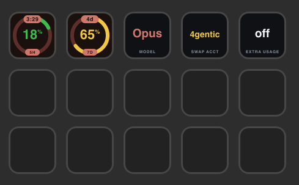
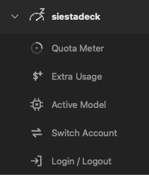

<p align="center"></p>

# siestadeck

> **Time to siesta.** — Live Claude Code telemetry on your Elgato Stream Deck.

[](https://github.com/aguilarguisado/siestadeck/actions/workflows/ci.yml)
[](LICENSE)
[](https://docs.elgato.com/streamdeck/sdk/)
[](https://nodejs.org/)


siestadeck turns physical Stream Deck keys into a live readout of your Claude Code quota, spend, and active model — and gives you a one-press multi-account switcher. It reads from your local `~/.claude/` telemetry plus Anthropic's OAuth usage endpoint, with strict on-demand polling and automatic rate-limit handling.

<p align="center"></p>

## Why siestadeck

- **Glanceable quota.** See your 5-hour and 7-day Max windows without opening a terminal or the Claude app.
- **Safe by default.** No background polling unless you explicitly enable it. Manual refresh on key press; minimum 5-minute interval when auto is on; automatic backoff on `429`.
- **One-press account swap.** Keep your personal and work Claude logins on the same deck; switch between them instantly without a browser round-trip.

Tested on Stream Deck MK.2 (15 keys) on macOS. Designed to also work on XL, +, Mini, Neo, and Pedal. Windows support is in the codebase and CI builds green, but hasn't been validated end-to-end on a physical Windows + Stream Deck setup — community validation welcome.

> **Heads up on the quota endpoint.** The 5h / 7d numbers come from an undocumented OAuth usage endpoint that Anthropic uses internally. It is aggressively rate-limited and may change without notice. siestadeck never polls it on a tight loop: refresh is **manual by default**, and the optional background poll is capped at one request every 5 minutes per account. Using undocumented endpoints is at your own risk — see the [Disclaimer](#disclaimer) below.

## Install

The easiest way to get siestadeck onto your deck:

1. Download the latest `siestadeck.streamDeckPlugin` from the [**Releases**](https://github.com/aguilarguisado/siestadeck/releases) page.
2. Double-click the downloaded file. Stream Deck installs the plugin and the **siestadeck** action category appears in the right sidebar.
3. Drag the actions you want onto your keys.

On first run the plugin auto-adopts whatever account Claude Code is currently logged in as — no extra setup needed.

**First-run note (macOS):** the OS will prompt for permission to access the `Claude Code-credentials` keychain entry. Click **Always Allow** — otherwise the quota meter stays on `--%`.

## Build from source

If you'd rather build it yourself (or want to hack on it):

```sh
git clone https://github.com/aguilarguisado/siestadeck.git siestadeck && cd siestadeck
npm install
npm run icons      # rasterize SVGs → manifest PNGs
npm run build      # bundle plugin.js into io.github.aguilarguisado.siestadeck.sdPlugin/bin/
npm run link       # symlink the plugin into Stream Deck
```

Open Stream Deck — the siestadeck actions appear in the right sidebar under their own category.

## Actions

siestadeck ships five actions. They appear in the Stream Deck sidebar under their own **siestadeck** category — drag any of them onto a key.

<p align="center"></p>

| Action | What it shows | Press to | PI options |
|---|---|---|---|
| **Quota Meter** | Radial 5h or 7d quota %, color-coded green/amber/red | Force-refresh the quota | Window, auto-poll on/off |
| **Extra Usage** | Real pay-as-you-go spend billed beyond your Max plan this month, with the monthly cap | Force-refresh the quota | — |
| **Active Model** | Current model (Opus / Sonnet / Haiku) with version | Cycle the default model | — |
| **Switch Account** | Active account or "→ next" hint | Cycle or jump to a specific account | Mode, target |
| **Login / Logout** | `log in` / `log out` / `+ account` | Open Terminal with the matching `claude auth …` command | Mode, display name |

## Quota polling

The quota endpoint is the only piece of siestadeck that talks to Anthropic's servers. Everything else reads from local files. Polling behavior:

- **Default: off.** Out of the box, the quota meter only refreshes when you press the **Quota Meter** key. If you never press one, the plugin never calls Anthropic.
- **Optional background poll: 5-minute minimum interval.** You can turn on auto-refresh in the Quota Meter's Property Inspector. The minimum (and default) interval is 5 minutes per account; the plugin will not let you set it lower.
- **Automatic backoff on `429`.** If the endpoint rate-limits you, the plugin backs off (1 → 10 minutes) before trying again, regardless of the configured interval.

In practice this means a typical setup makes a handful of requests per day, only when you're actively curious about your usage.

## Multi-account setup

siestadeck is designed for **one person** who has more than one Claude account they personally control — for example, a personal account and a work account. Each account is a single keychain entry (`siestadeck-token-<slug>`) plus a row in `~/.config/siestadeck/accounts.json`. Only accounts you log into yourself on this machine are saved.

**Adding accounts**

1. Drop a **Login / Logout** key on your deck and set its mode to **Add account** with a display name (e.g. `work`).
2. Press the key. Terminal opens running `claude auth login`.
3. Complete the browser OAuth flow.
4. When you press Enter at the prompt, siestadeck captures the new credentials and saves them as a new account.

**Swapping**

Use a **Switch Account** key in cycle mode to rotate through your accounts, or set a key's target to a specific account for a direct jump. The swap is instant — no browser, no logout.

> **Please don't use this to share a Claude account with other people.** The Claude Max plan is for individual use; sharing credentials across teammates violates Anthropic's terms. siestadeck is a personal multi-account convenience tool, not a team-sharing workaround.

## Privacy & data flow

siestadeck is a local utility. It does not phone home, does not collect analytics, and does not contact any third party other than Anthropic's official API. Specifically:

- **Reads** your Claude Code OAuth token from the OS credential store — macOS Keychain entry `Claude Code-credentials`, or on Windows the `claude` CLI's `~/.claude/.credentials.json`. Written by Anthropic's `claude` CLI, not by this plugin.
- **Reads** `~/.claude/projects/*/*.jsonl` transcripts from your local disk to surface the active model.
- **Sends** authenticated `GET` requests to `https://api.anthropic.com/api/oauth/usage` with that token in the `Authorization` header. The response carries your 5h/7d quota and your pay-as-you-go extra-usage spend. No other data is sent; no other endpoint is contacted.
- **Writes** per-account credentials so you can switch without re-logging in. macOS: Keychain entries named `siestadeck-token-<slug>`. Windows: DPAPI-encrypted files under `%APPDATA%\siestadeck\creds\` (each blob is encrypted with the Windows user's DPAPI key — only that account can decrypt).
- **Writes** an account registry containing only display name, email, slug, color, and tier — no tokens. Path: `~/.config/siestadeck/accounts.json` (macOS) or `%APPDATA%\siestadeck\accounts.json` (Windows).
- **Opens** Terminal.app via `osascript` (macOS) or `cmd /k` (Windows) for OAuth login/logout flows so you can complete the browser auth round-trip yourself.

No analytics, no telemetry, no third-party servers. The source is open — verify it yourself.

## Extra Usage

The **Extra Usage** action shows a real dollar figure — not an estimate. It comes straight from the `extra_usage` block of Anthropic's OAuth usage response: the pay-as-you-go amount Anthropic has billed you for usage **beyond** your Claude Max subscription this month, alongside your configured monthly cap.

A few things to know:

- If you stay within your 5h / 7d Max windows and have never enabled pay-as-you-go, this reads `off` — there is no overage to show.
- It is **not** "what your usage would have cost on the API," and it does not include the value of your subscription itself. It is purely the metered overage.
- It refreshes on the same endpoint and the same schedule as the Quota Meter — manual by default, optional 5-minute background poll.

siestadeck deliberately does **not** ship a guessed-from-tokens cost estimate. For a local per-session cost breakdown, `npx ccusage daily` is the right tool.

## Configuration

| Path | What |
|---|---|
| `~/.claude/projects/*/*.jsonl` | Active-session transcripts the Active Model service tails (read-only) |
| `~/.config/siestadeck/accounts.json` | The plugin's account registry (slug, label, email, color, tier) |
| Keychain: `Claude Code-credentials` | Claude Code's own OAuth token (read by the plugin's "active account" poller) |
| Keychain: `siestadeck-token-<slug>` | The plugin's per-account credential stash |

## Troubleshooting

- **Quota meter stuck on `--%`** — most likely the macOS Keychain prompt was dismissed, or you haven't pressed the key yet (refresh is manual by default). Run `security find-generic-password -s "Claude Code-credentials" -w` in a terminal once, click "Always Allow", then press the Quota Meter key.
- **`HTTP 429` in the plugin log** — the OAuth endpoint is aggressively rate-limited. The plugin backs off automatically (1 → 10 minutes); just wait it out, or turn auto-poll off and refresh on demand.
- **A new account I added isn't showing up in the PI dropdown** — close and reopen the Property Inspector, or restart the plugin with `npm run restart`.
- **Extra Usage shows `off`** — that's expected unless you've enabled pay-as-you-go billing beyond your Max plan. It only shows a dollar figure when Anthropic is actually metering overage.

## Repo layout

```
src/
  actions/         one TS file per Stream Deck action
    draw/          pure, testable render cores for each action
  services/        quota poller, active-session watcher, accounts, keychain, terminal
  render/          SVG templates + theme tokens
io.github.aguilarguisado.siestadeck.sdPlugin/
  manifest.json    Stream Deck plugin manifest
  bin/             rollup output (gitignored)
  imgs/            rasterized PNG assets (built from assets/icons/*.svg, gitignored)
  pi/              Property Inspector HTML
assets/icons/      hand-authored SVG glyphs (source of truth for action icons)
scripts/           one-off Node utilities (icon rasterizer, release-readiness check)
```

## Contributing

PRs welcome. See [CONTRIBUTING.md](CONTRIBUTING.md) for prerequisites, local setup, and the architectural rules (the most important: **actions are stateless renderers** — they never poll, fetch, or read files; all I/O lives in services). The per-directory `CLAUDE.md` files document each layer in detail.

Security issues: please report privately per [SECURITY.md](SECURITY.md).

## Acknowledgements

- [Elgato](https://www.elgato.com/) for the Stream Deck SDK.
- [Anthropic](https://www.anthropic.com/) for the `claude` CLI and the data formats this plugin reads.
- [`@resvg/resvg-wasm`](https://github.com/yisibl/resvg-js) for the SVG-to-PNG rendering pipeline.

## Disclaimer

siestadeck is provided **as-is**. It reads your own local telemetry and calls endpoints using credentials you own, but Anthropic's Terms of Service — not this project — govern your account. The authors and contributors are **not responsible** for any account suspension, rate limiting, credential revocation, billing dispute, or other action taken against your Claude account, Anthropic API access, or Elgato Stream Deck setup as a result of using this plugin. The quota endpoint is undocumented and may change or be withdrawn at any time. If you're not comfortable with that risk, don't install the plugin.

## License

MIT. See [LICENSE](LICENSE). © 2026.

---

*siestadeck is an independent open-source project. It is not affiliated with, endorsed by, or sponsored by Anthropic. "Claude" is a trademark of Anthropic, PBC. "Elgato" and "Stream Deck" are trademarks of Corsair Memory, Inc.*
